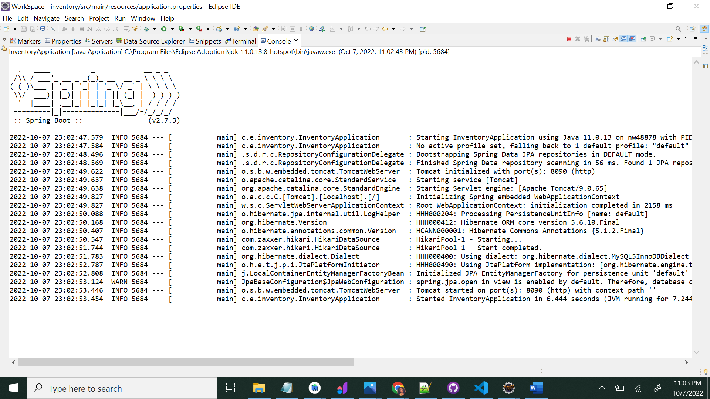

# PROJECT

### Table of contents

#### * [Team Members](#team-members)
#### * [Project ideas](#project-ideas)
#### * [Inventory maintanance](#inventory-maintanance)
#### * [Project abstract](#project-abstract)
#### * [Tools Installation](#tools-Installation)
#### * [UI blueprint](#ui-blueprint)
#### * [Database schema](#database-schema)
#### * [List of items info on our page](#items)
#### * [Adding dependecies in pom.xml](#adding-dependecies-in-pom.xml)
#### * [UI design](#ui-design)
#### * [Login page](#Login-page)
#### * [API running status image](#API-running-status-image)
#### * [mysql dependencies](#mysql-dependencies)
#### * [Category table](#Category-table)
#### * [Adding log4j dependency](#adding-log4j-dependency)
### Team Members
* Trilochan Reddy Sama
* Thrinadh Chowdary Gutta
* Sravani Jakkula
* Sasank Srinivas Nadendla

### Project ideas

#### Get Farmer Application

My idea is simple and useble. 
It is gonna be use customers and farmers. Now-a-days **farmer** is the only person who ***losses*** everything what they have.
So, I am going to create web application for **_farmers and customers_**. By using this application customers gonna get everything what they want from farmers. 
So if we use this app customers get with low prize and organic things and avoid of buyers and avoid risk factors.


we have couple ideas and eventually we finalized ***Inventory maintanance*** 

#### Inventory maintanance
Project All about the inventory maintanance , it means helps companies identify which and ***how much stock*** to order at what time
The practice identifies and responds to trends to ensure there's always enough stock to fulfill customer orders and proper warning of a shortage

#### Project abstract
Maintaining the records for a particular asset information which includes its type, department it belongs to, user assigned and its history, due date on it. 
Department is the owner of the asset and admin is responsible regarding asset allocation.

My role is all about Database.
Database is nothing but An organized collection of structured information, The database management system is usually responsible for managing databases.
In a database, information is organized, managed, and updated easily. A computer database is a repository for storing aggregated data, such as sales transactions, customer data, financial information, and product information, in a database.

Use of **Database** is nothing but Information itself can be stored in a variety of ways; before digital computers, card files, printed books, and other methods were used, information was stored in paper.


our next step is, based on our project i am gonna do the data base. so my team members, every body do your own roles and responsibiities and we gonna do project that we can implement idea and we gonna find our own requirements and we will rock.


### Tools Installation
#### Working on Tools installation

I just installed tools that what i want for database.
* REACT
* SPRINGBOOT
* MYSQL

# UI Blueprint

I just draw blueprint of idea and i will create pages for our idea.
i installed apps and information about idea


#### Information about database 
i decided to take sql developer tool for database
i just installed and i will work on that.

#### Packages and libraries required

Refreshed my knowledge on APIs and gonna through some reference related to project.
Added libraries required for me to start my work and configured Maven to Eclipse IDE.

### Analyzing the idea and exploring about the features

I proposed few views for developing the UI and knowing about the features needed for our website.

##### UI design


#### web pages
i just started the webpages and i will do get information and i will do more 
just created login page

#### login page is ready
Login page is created but this is not the finalized one there are some changes on this and my next step is to work on some other web pages 


# database schema

i will prepare the database schema regarding the project

# working on Login page 
as we have developed a basic login page we are working on it to make it more user friendly and attractive.

### List of items info on our page
* MACs
* Desktops
* Xerox machine
* Pens and markers
* Tables and chairs
* Papers


#### gathering information regarding which items should be included in the ineventory
as per discussion we have decided to keep track of laptops,books,A4 size papers,pens,chairs,tables etc

#### SQL developer 
just installed the app
i will get info and start the process

#### working on centralized data base
gone through centralized data bases host i.e; go daddy


#### Working On Web Pages 
created Home pages
In that Home page , I just created some logos and some information


#### working on database schema
working on database schema and created a AWS IAM by admin and connected it to MYSQL work bench and working on it..


#### working on creating login page and Home page
As discussed in call working on Creating effective login page and home page with appropriate color combinations.

#### Dependencies
In Eclipse workspace created a maven project called InventoryAPI.
Added maven dependicies and plug-ins in pom.xml file.

#### working on database 
Data base schema is prepared and iam going to create tables and i will be working on it.

#### Going through react frame works
Working on react frame works to create a user friendly applications


#### Working on CSS
Working on  Style sheets  to make web page attractive.

#### Working on Database Schema and tables
Working on database schema and tables and learning the JPI

### Database schema


#### Entities
created a package called com.example.inventoryAPI.entity in Inventory API and added the entity classes and attributes in it. Waiting on database schema approval.

### UPdated schema
Made a changes on the database schema the finilized schema is ready and in this project we are using centralized database that is AWS in that i created database for our project and i connected that AWS database to my MySQL workbench and working on it. 

#### Admin and user login functionality
Working on implementation of admin and user differentiation login functionality and have to test whether data given while registering is getting stored in the databse or not.


### Working on UI
working on creating User login and user Register form.


### Working on the tables

Working on the tables in the centralized database after that i am going to work on backend part.

### Final Login Page view


### Tables created in centralized database
Tables are created successfully in centralized database working on backend implementation part

### Adding dependecies in pom.xml
Missed jpa dependecies in the pom.xml which is required for conncting our api to ui.
Added below dependencies
<dependency>
			<groupId>org.springframework.boot</groupId>
			<artifactId>spring-boot-starter-data-jpa</artifactId>
</dependency>

### Finalized schema is ready 
 started working on creatng tables in the AWS there are only 1 table left after that iam going to work on implementation part 

### working on the database tables
working on the centralized database tables and started doing an implementation part here i faced some of the issues while connecting the centralized database to my sql workbench finally i resolved it..


### working on JPA connectivity
working on functionality part i.e; retrieving data from front end and storing in data base 


### working on React framework
Working on creating home page and login using react framework.

#### week 5 accomplishments
Completed working on relationships between entities in database schema.
Worked on web pages and added components to the home page.
Started implementation for login and register page.
Trying to store data in the remote database.

### working on connectivity
Iam using JPA to connect backend and database to learn JPA first i should learn JDBC and springboot i started working on them 


### Collecting Information regarding React for workshop.
Working on preparing PPT regarding react framework for Workshop.

#### Saving data
Data is getting stored in the local database. So, now need to make connectivity from api to remote database. Going ahead with JPA.

### Working on implementation part
Working on ORM (i.e) Object Relation Mapping and tables are created in the databases

### Working on workshop presentation
gathering information about JPA and AWS to present in workshop.

### Working on installing packages for react.
Working on installing NPM(node package manager) packages so that we can create react applications.


### worked on Workshop presentation and gone through react framework.
Prepared for workshop presentation and working with react framework.

### Working on ORM
started working on object-relation mapping after that we will going to test it. database tables are created.

### updating data
Local database is getting update while we try to post a JSON object to the UI.
Trying to test using postman.

### resolving issue
While trying to run the API on the given port, it is getting failed and throwing an error related to jdbc template.
Working on it by adding related dependecies to the xml file.

### API status
Inventory API is started and running on the port 8090. User can able to login and registration data is getting stored in the database once we hit the postmapping method.

### Working on the implementation

Working on JPA connectivity we tried to store some values from postman to Remote database the values are stored successfully.


### Working on Implementation
Working on Home page components of Inventory maintenace project.

### working on Styling for login and register page.
Done with the styling part for home and login page.

### Wroking on connectivity
working on JPA connectivity with the help of OMG for object relational mapping we are using hibernate in the backend.

### working on connectivity part front end to backend
facing difficuly while connecting frontend to backend we are working on it.


### Working on frontend home page components
Working on Home page page components using react Js.

#### mysql dependencies
Added mysql dependencies to the pom.xml file which is used to connect api to database.
```
		<dependency>
			<groupId>mysql</groupId>
			<artifactId>mysql-connector-java</artifactId>
			<scope>runtime</scope>
		</dependency>
```
#### API running status image


### working on JPA
working on JPA connectivity and frontend API calls

### working on creation of tables in AWS
While  creating the tables in the database asset table and asset history table faced some issues working on the remaining tables are created successfully 

### Tables are created and tested
Creation of tables is done it needs to be tested the values are stored from the postman but they need to be tested from frontend pages

### Working on Connectivity
Working on retriving data from front end to spring boot.

#### Added entities
Application is up and running on port 8090.
Started working on home components and added relevant entities under src/main/java/com.example.inventory.entities package.

#### Achieved Objectives
Blueprint for home page is ready. Creation of tables is done it needs to be tested the values are stored from the postman, but they need to be tested from frontend pages.
Added JDBC template and dependencies, can create tables in the database workspace once api starts running.


### Started working on APIs

My work was done like tables are created and those tables are tested with the help of postman so I am helping my teammates on developing APIs.


### Working on functionality
Working on Functionality part i.e; retriving data fron front end and store data in data base.

### Register page working is done
Worked on register API when we tryed to store some data though frontend signup page API working good and the data is also stored successfully.

### working on asset table 
inserting the asset record in asset table is done successfully goinf to work on update the asset in the asset table

### Category table
Created category table and added attributes. Able to load the data  and retrieve the data from and to the database.

### Department table
Under entities package added Department.java class with attibutes called id, name. Data is getting stored in the table at the database end and able to fetch the data from the database. Bascially, this table will have only two records as computer science contains only two departments i.e; Applied computer science and information systems.
Able to store the data into the department table. Stored data is getting fetched with the help of the api. Modifying one of the fields of the table with the user id or the asset id implementation is in progress. Able to delete the record from the table. 

### Asset table
Done with updating the asset in the asset table and to read the asset from the asset table is done successfully.

### Working on deleting asset
working on deletion operation on asset in the asset table and there is a small correction on asset post request in the backend it need to be updated.

### Asset table is done 
All operations are done on the asset table like inserting an asset deleting an asset reading asset and updating the asset going to work with asset history table


### category table is done
creation and insertion of category table is done
Able to load the data to the databse and can fetch it. Category table should contains catergoreis like laptops, macbooks, nmarkers, erases, hdmi cords. Once user logins he/she should select the catergory of item they want to check out. This table is pretty much showcasing the categories of the assets.

### Asset History Table is done
creation and insertion of Asset History Table  is done
can able to see the information of Asset History and asset is nothing but one item 
we can able to see the information of student asset history
so it shows that who check in the item and who check out the item.

### Asset table
successfully storing the asset in thge asset table and updating it and reading asset from the asset table in the database and we tested through postman theseall operations are working perfect.

### Working On Home page
I have Created Static Home page components and i am getting isuues and it is not like what i expect
I need to style that page and add some css 
I need to create page and components dynamically 

### working on home page components within homepage components working on HDMI category
Working on HDMI category in the home page component.
while working on HDMI home page component the functionality is not working .
workig on related errors.

### adding log4j dependency
> <dependencies>
        <dependency>
                <groupId>org.apache.logging.log4j</groupId>
                <artifactId>log4j-core</artifactId>
                <version>2.8.2</version>
        </dependency>
</dependencies>

### Accomplishments
Crud operations of all the main entities is completed.
Able to modify the user for a particular asset. Can de-tag the asset from one user and able to assign it to the new user.
Able to get the asset history from a specified date for a particular asset.


### category table
successfully able to create the category table and able to store data in category table.

### Asset table error
if we update the asset in the asset table the date of that asset is not correct if we give today’s date it will change to yesterday’s date that is fixed

### dependency odpi
<dependency>
    <groupId>org.odpi.egeria</groupId>
    <artifactId>audit-log-framework</artifactId>
    <version>3.13</version>
</dependency>

### Asset table 
I facing issues with the asset assigned date if we assign an asset to a particular person on this day it was not taking today’s date it is taking tomorrow’s date