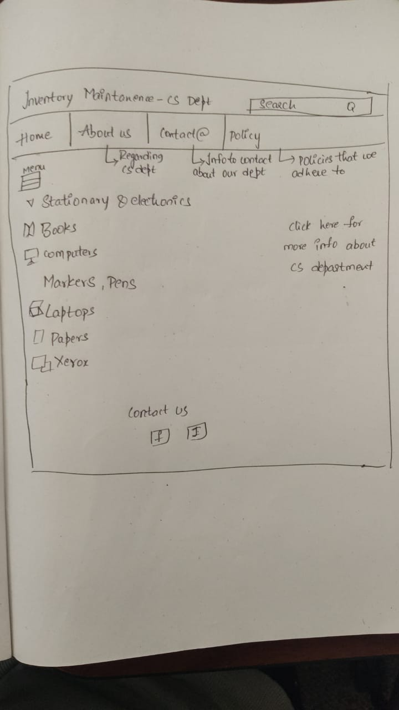

# PROJECT
### My Idea

#### Get Farmer Application

My idea is simple and useble. 
It is gonna be use customers and farmers. Now-a-days **farmer** is the only person who ***losses*** everything what they have.
So, I am going to create web application for **_farmers and customers_**. By using this application customers gonna get everything what they want from farmers. 
So if we use this app customers get with low prize and organic things and avoid of buyers and avoid risk factors.

we have couple ideas and eventually we finalized ***Inventory maintanance*** 

Project All about the inventory maintanance , it means helps companies identify which and ***how much stock*** to order at what time
The practice identifies and responds to trends to ensure there's always enough stock to fulfill customer orders and proper warning of a shortage

My role is all about Database.
Database is nothing but An organized collection of structured information, The database management system is usually responsible for managing databases.
In a database, information is organized, managed, and updated easily. A computer database is a repository for storing aggregated data, such as sales transactions, customer data, financial information, and product information, in a database.

Use of **Database** is nothing but Information itself can be stored in a variety of ways; before digital computers, card files, printed books, and other methods were used, information was stored in paper.

our next step is, based on our project i am gonna do the data base. so my team members, every body do your own roles and responsibiities and we gonna do project that we can implement idea and we gonna find our own requirements and we will rock.

# Working on Tools 

I just installed tools that what i want for database.

# UI Blueprint

I just draw blueprint of idea and i will create pages for our idea.
i installed apps and information about idea

#### Information about database 
i decided to take sql developer tool for database
i just installed and i will work on that.

#### Packages and libraries required

Refreshed my knowledge on APIs and gonna through some reference related to project.
Added libraries required for me to start my work and configured Maven to Eclipse IDE.

### Analyzing the idea and exploring about the features

I proposed few views for developing the UI and knowing about the features needed for our website.

##### UI design

#### web pages
i just started the webpages and i will do get information and i will do more 
just created login page

#### login page is ready
Login page is created but this is not the finalized one there are some changes on this and my next step is to work on some other web pages 

# database schema

i will prepare the database schema regarding the project

# working on Login page 
as we have developed a basic login page we are working on it to make it more user friendly and attractive.

### List of items info on our page
* MACs
* Desktops
* Xerox machine
* Pens and markers
* Tables and chairs
* Papers

#### gathering information regarding which items should be included in the ineventory
as per discussion we have decided to keep track of laptops,books,A4 size papers,pens,chairs,tables etc

#### SQL developer 
just installed the app
i will get info and start the process

#### working on centralized data base
gone through centralized data bases host i.e; go daddy

#### Working On Web Pages 
created Home pages
In that Home page , I just created some logos and some information

#### working on database schema
working on database schema and created a AWS IAM by admin and connected it to MYSQL work bench and working on it..

#### working on creating login page and Home page
As discussed in call working on Creating effective login page and home page with appropriate color combinations.

#### Dependencies
In Eclipse workspace created a maven project called InventoryAPI.
Added maven dependicies and plug-ins in pom.xml file.

#### working on database 
Data base schema is prepared and iam going to create tables and i will be working on it.

#### Going through react frame works
Working on react frame works to create a user friendly applications

#### Working on CSS
Working on  Style sheets  to make web page attractive.

#### Working on Database Schema and tables
Working on database schema and tables and learning the JPI

### Database schema

#### Entities
created a package called com.example.inventoryAPI.entity in Inventory API and added the entity classes and attributes in it. Waiting on database schema approval.

### UPdated schema
Made a changes on the database schema the finilized schema is ready and in this project we are using centralized database that is AWS in that i created database for our project and i connected that AWS database to my MySQL workbench and working on it. 

#### Admin and user login functionality
Working on implementation of admin and user differentiation login functionality and have to test whether data given while registering is getting stored in the databse or not.

### Working on UI
working on creating User login and user Register form.

### Working on the tables

Working on the tables in the centralized database after that i am going to work on backend part.

### Final Login Page view

### Tables created in centralized database
Tables are created successfully in centralized database working on backend implementation part

### JPA dependency
Missed jpa dependecies in the pom.xml which is required for conncting our api to ui.
Added below dependencies
<dependency>
			<groupId>org.springframework.boot</groupId>
			<artifactId>spring-boot-starter-data-jpa</artifactId>
</dependency>

### Finalized schema is ready 
 started working on creatng tables in the AWS there are only 1 table left after that iam going to work on implementation part 

### working on the database tables
working on the centralized database tables and started doing an implementation part here i faced some of the issues while connecting the centralized database to my sql workbench finally i resolved it..