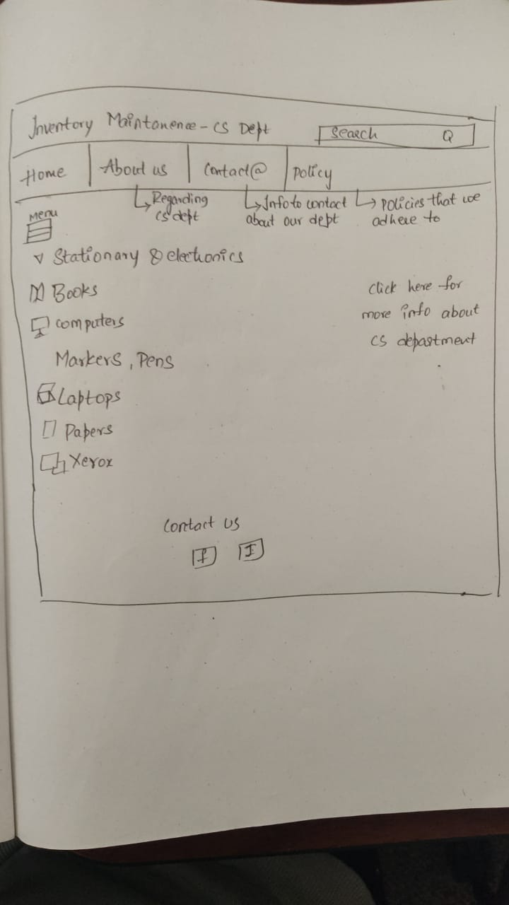
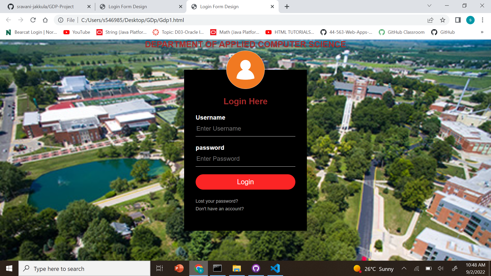

# PROJECT
### My Idea

#### Get Farmer Application

My idea is simple and useble. 
It is gonna be use customers and farmers. Now-a-days **farmer** is the only person who ***losses*** everything what they have.
So, I am going to create web application for **_farmers and customers_**. By using this application customers gonna get everything what they want from farmers. 
So if we use this app customers get with low prize and organic things and avoid of buyers and avoid risk factors.

we have couple ideas and eventually we finalized ***Inventory maintanance*** 

Project All about the inventory maintanance , it means helps companies identify which and ***how much stock*** to order at what time
The practice identifies and responds to trends to ensure there's always enough stock to fulfill customer orders and proper warning of a shortage

My role is all about Database.
Database is nothing but An organized collection of structured information, The database management system is usually responsible for managing databases.
In a database, information is organized, managed, and updated easily. A computer database is a repository for storing aggregated data, such as sales transactions, customer data, financial information, and product information, in a database.

Use of **Database** is nothing but Information itself can be stored in a variety of ways; before digital computers, card files, printed books, and other methods were used, information was stored in paper.

our next step is, based on our project i am gonna do the data base. so my team members, every body do your own roles and responsibiities and we gonna do project that we can implement idea and we gonna find our own requirements and we will rock.

# Working on Tools 

I just installed tools that what i want for database.

# UI Blueprint

I just draw blueprint of idea and i will create pages for our idea.
i installed apps and information about idea

# Information about database 
i decided to take sql developer tool for database
i just installed and i will work on that.

# Packages and libraries required

Refreshed my knowledge on APIs and gonna through some reference related to project.
Added libraries required for me to start my work and configured Maven to Eclipse IDE.

### Analyzing the idea and exploring about the features

I proposed few views for developing the UI and knowing about the features needed for our website.

##### UI design

# web pages
i just started the webpages and i will do get information and i will do more 
just created login page

# login page is ready
Login page is created but this is not the finalized one there are some changes on this and my next step is to work on some other web pages 

# database schema

i will prepare the database schema regarding the project

# working on Login page 
as we have developed a basic login page we are working on it to make it more user friendly and attractive.

### List of items info on our page
* MACs
* Desktops
* Xerox machine
* Pens and markers
* Tables and chairs
* Papers